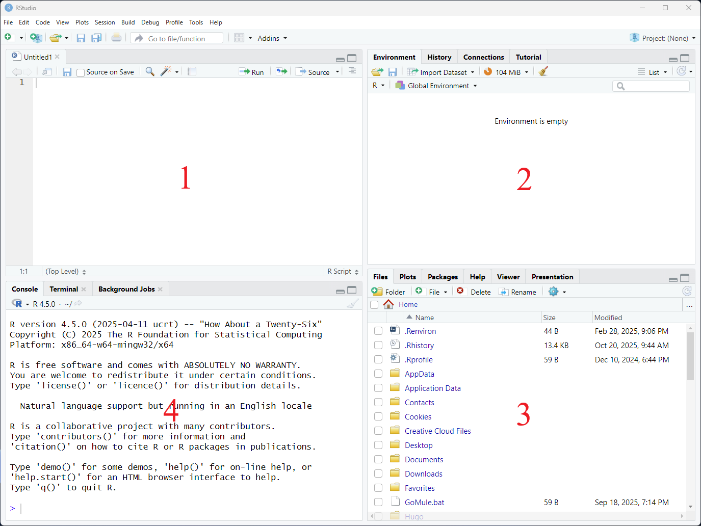
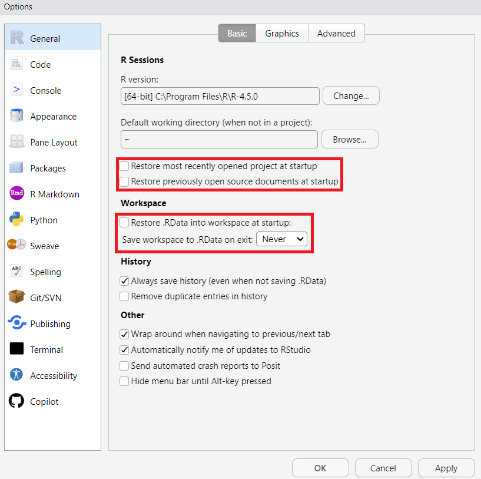

# Data Analysis and Visualisation in R

This is an introduction to R designed for participants with no programming experience. 

## Set up

1. Install R & RStudio

On a University device:

- Search 'R project' in the Software Center / Self Service and install.
- Search RStudio in the Software Center / Self Service and install.

On a personal device:

- Install [R](https://cran.stat.auckland.ac.nz/) and then [RStudio](https://posit.co/download/rstudio-desktop/) directly.

2. Install required R package

- In RStudio, click on Tools -> Install Packages.
- Type `tidyverse` and click install.
- Wait for the background process to finish (can take a couple of minutes).

3. Know how to check for updates

- Keep R up to date by checking Software Center or CRAN every now and then.
- Keep RStudio up to date by checking Software Center or following the automatic prompts in outdated versions.
- Keep packages up to date by clicking Tools > 'Check for package updates' every now and then.

3. Download the data

- Download the [data file]("data/surveys_complete.csv") and save it somewhere convenient.

## Introduction to R & RStudio

### What are R & RStudio?

R is a programming language as well as the software that runs R code written in that language.

RStudio is separate software which provides an interface that makes it more conveneient to interact with R and write R code.

### Why learn R?

1. Programming is more efficient than pointing and clicking

- Instead of remembering what you clicked on and in what order, writing out R code and saving it in a script file makes it far easier to see what you did and why. 
- If your data changes, or you have another similar dataset, a script can be rerun in seconds.

2. R is great for reproducibility

- By publishing your data and code, you ensure that your results are transparent, verifiable, and can be built on by others.

3. R can do just about anything

- R was originally written with statistics in mind, but it has been expanded and extended over the years into a fully fledged programming language capable of performing all kinds of tasks.
- R works on data of all shapes and sizes, and there are community-developed packages to make it easier to perform all kinds of analyses and workflows.

4. R produces famously good graphics

- With R you can create professional-looking plots and figures to submit to journals with your manuscripts.

5. The R community is welcoming and helpful

- R is popular among researchers so you'll find large and welcoming communities of fellow R users in places like [Stack Overflow](https://stackoverflow.com/) or the [Posit Forums](https://forum.posit.co/) (Posit is the company which makes RStudio).

### Navigating RStudio

RStudio can help with many advanced tasks, but we're going to be focussing on the core features.

In the default layout there are 4 panes, clockwise from top left:

1. Top left: Source pane. Displays scripts, data, and other files.
2. Top right: Environment pane. Displays the objects in your current R session.
3. Bottom right: Files pane. Displays a file explorer, any plots you create, and help information.
4. Bottom left: Console. Where commands are executed by R.



These 4 panes contain most of the features you need to start working with R.

We will also change a couple of settings by selecting Tools → Global Options:



Ensure the settings under 'R sessions' are unticked, and the settings under 'Workspace' are unticked and set to 'Never'. This ensures R starts a fresh session each time you open it and helps to prevent confusion, especially when learning.

Other RStudio features we will see as the lesson progresses:

- Keyboard shortcuts
- Autocompletion
- Syntax highlighting

### Getting Set Up in RStudio

It's good practice to organise files relating to research projects into their own project folder. A well-organised project is easier to navigate, more reproducible, and easier to share with others.

Let's create a basic project directory outside of RStudio now to mimic the kind of project we might already have going. For the purposes of this lesson we will create our project folder on the desktop, but you will likely have your project folders elsewhere (such as in a research drive). 

Create the following folders:

```
r-workshop
│
└── R
│
└── data
│
└── fig
```

RStudio provides a “Projects” feature that makes it easier to work on individual projects in R. We will create an R project using the project folder we just created.

1. In the top right, you will see a blue 3D cube and the words “Project: (None)”. Click on this icon.
2. Click New Project from the dropdown menu.
3. Click 'Existing folder'.
4. Click 'Browse' and find the 'r-workshop' folder on your desktop, and click 'Create'.
5. The project will open in RStudio, the files pane will open to the project folder, and you'll notice a new file called 'r-workshop.Rproj' in the r-workshop folder.

One of the benefits of using RStudio projects is that they automatically set the working directory to the top-level folder for the project (r-workshop here). The working directory is the folder where R is looking for files to bring in, and the place to save outputs. R views the location of all files in the project as being relative to the working directory. You may come across scripts that include something like setwd("/Users/YourUserName/MyRProject"), which directly sets a working directory. But this script is unlikely to run on anyone elses computer, since that specific directory is probably unique to the person who wrote the script. Using RStudio Projects means we don’t have to deal with manually setting the working directory, and it means that R projects are fully self-contained.

Next time you open RStudio, you can click that 3D cube icon, and you will see options to open recent projects, like the one you just made.

Let's move the workshop [data file]("data/surveys_complete.csv") into the data folder now.

### Working in R & RStudio

The essence of programming is writing down instructions for the computer to follow, and then telling the computer to follow those instructions.We write the instructions in **code**, which is a common language that is understood by the computer and humans (after some practice). We call these instructions commands, and we tell the computer to follow the instructions by running (also called executing) the commands.

**Console vs. script**

You can run commands directly in the R console, or you can write them into an R script. It may help to think of working in the console vs. working in a script as something like cooking. The console is like making up a new recipe, but not writing anything down. You can carry out a series of steps and produce a final dish at the end. However, because you didn’t write anything down, it’s harder to figure out exactly what you did, and in what order.

Writing a script is like taking notes while cooking. You can tweak and edit the recipe all you want, you can come back in 6 months and try it again, and you don’t have to try to remember what went well and what didn’t. To cook the recipe again we can hita single button in RStudio to run an entire script.

You can also leave comments for yourself or others to read in your script. Lines that start with # are considered comments and will not be interpreted as R code.

*Console*

- Code is run/executed
- Commands are typed at the prompt > symbol
- R runs the commands when you press enter
- What you write here is lost when your RStudio session ends

*Script*

- A record of commands to send to R
- A plain text file with a .R extension
- File → New File → R Script, or Shift+Cmd+N (Mac) or Ctrl+Shift+N (Windows)
- Regularly save scripts to avoid losing your work
- R code in a script can be sent to the console with Cmd+Enter (Mac) or Ctrl+Enter (Windows)
- Leave comments by starting lines with #
- Insert sections with Shift+Cmd+R (Mac) or Ctrl+Shift+R (Windows)

Most of our R code should be saved in a script, but sometimes we need to do things that we don't need to preserve in our script. For example, we shouldn't put commands to install packages in our scripts, but we do need to load the packages we use at the start of a script.

### R Fundamentals

**R as a calculator**

Go ahead and type a math equation into the console and hit enter. Note how the result is printed immediately. Now type the equation into a new script and hit enter. Note how the cursor moves to a new line. To run the equation in the script, click anywhere on the line of code and either click the 'Run' button on the top right of the script, or use Cmd+Enter (Mac) or Ctrl+Enter (Windows) to send the equation to the console.

From now on, use a script to write and execute the code in this workshop.

**Assignment**

In R, we can *assign* values to objects by using the assignment arrow `<-` (shortcut Alt+- on Windows/Linux and Cmd+- on Mac). Whatever is on the right of the arrow will be assigned to whatever is on the left. To create an object we provide a name for the object and assign a value. 

For example, to assign the number 50 to an object called weight:

```
weight <- 50
weight
```

We can do calculations with objects and store the results in other objects:

```
weight_lb <- weight * 2.2
weight_lb
```

We can override assignment

```
weight <- 100
```

Even though we've changed the value of weight, the value of weight_lb does not change, unless we run the conversion to pounds again.

When naming objects:

- use nouns
- be descriptive but concise
- use a consistent code style (like lower_snake)

**Functions**

Functions are the workhorse of many programming languages, including R. Functions usually take one or more inputs, do something with the input, and create an output. We can think of a function as a piece of 'canned code' because they are made up of one or many lines of code in the background.

Inputs are called arguments, and if they're optional they're called options. Understanding which function to use to achieve a particular task comes with time and experience. To understand which arguments or options can be used we can look at the documentation provided for the function.

Let's look at the round() function as an example:

```
?round
```

We can see that round() takes x, a numeric vector, and an option called digits to indicate how many decimal places to round to. X is required so we need to provide it. We'll come back to vectors later, but for now we can think of vectors as one or more values:

```
round(x = 3.1412)
```

Note we get back 3. So the default behaviour is to round to whole numbers. If we wanted to specify differently, we could supply the digits option:

```
round(x = 3.1412, digits = 2)
```

When specifying arguments in the order expected by the function we don't have to name them:

```
round(3.1412, 2)
```

But it makes your code clearer to name arguments, especially when you're learning.

## Data Visualisation with ggplot2

